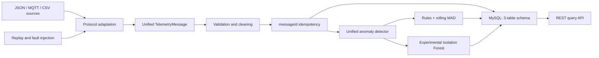

# Mangrove-MonitorLite

English · [简体中文](README.zh-CN.md)

A lightweight Java reference system for ingesting environmental telemetry, applying time-series quality checks, and serving anomaly-aware monitoring data.

## Overview

Mangrove-MonitorLite shows how heterogeneous environmental observations can enter one traceable processing path instead of separate device-specific backends. HTTP-origin JSON, MQTT JSON, and replayed CSV records are normalized into a shared telemetry model, validated, stored in a compact MySQL schema, evaluated for data-quality anomalies, and exposed through REST queries.

This repository is a personal, portfolio-oriented engineering reconstruction. It contains only the generic telemetry core, synthetic test data, and local verification assets; it is not an official field deployment or a copy of an organizational system.

## What it demonstrates

- One telemetry model for structured JSON, `fields`/`vals` payloads, MQTT messages, and CSV replay
- MQTT 3.1.1 ingestion with QoS 1 and message-level idempotency
- Required-field, timestamp, numeric, empty-value, and non-finite-value validation
- MySQL storage with a unique `message_id` constraint and traceable raw payloads
- REST queries for telemetry, anomaly events, time ranges, and anomaly types
- Sampling-gap rules, rolling median/MAD sudden-change detection, and experimental Isolation Forest scoring
- Deterministic replay with missing-record, spike, and multivariate fault injection
- Reproducible JUnit integration tests, including real localhost MQTT publish/subscribe over TCP

## Architecture



The project remains a single Spring Boot application. It does not introduce brokers, databases, dashboards, or model services that are not needed by the reference flow.

## Data flow

```text
Source record
  -> JSON/CSV adapter
  -> TelemetryMessage
  -> validation and numeric/time normalization
  -> duplicate check
  -> telemetry_record
  -> gap / rolling MAD / Isolation Forest evaluation
  -> anomaly_event
  -> REST queries
```

Every accepted message carries `messageId`, `deviceId`, `deviceType`, observation and receipt times, schema version, source protocol, normalized metrics, and its original payload. Unknown fields remain traceable in `rawPayload`; the code does not infer undocumented units or ecological meaning from a field name.

## Anomaly detection

### Sampling gaps

A configurable rule compares consecutive observation timestamps with the device's expected interval. An event records the expected interval, actual interval, allowed multiplier, and inferred missing range.

### Rolling median and MAD

Each device/metric pair maintains an independent rolling window. Once the window is warm, the detector computes:

```text
robust_z = 0.6745 * |value - median| / MAD
```

The implementation handles insufficient windows, non-finite values, and zero-MAD windows. This detector is an interpretable robust-statistics check for sudden changes, not an AI model.

### Experimental Isolation Forest

The Java implementation trains on a historical window of multivariate numeric records, fixes feature order, removes constant or incomplete columns, scores new records online, and retrains periodically. A fixed random seed makes tests repeatable. Insufficient training data and feature mismatches return explicit skip states rather than silent scores.

Isolation Forest output is an engineering data-quality signal. It is not, by itself, evidence of an ecological event, and this repository does not claim scientific validation or production alert accuracy.

## REST API

| Method | Path | Purpose |
|---|---|---|
| `GET` | `/api/telemetry?deviceId=...&from=...&to=...` | Query a device's telemetry in an optional time range |
| `GET` | `/api/anomalies?deviceId=...&from=...&to=...&type=...` | Query anomaly events with optional time/type filters |
| `GET` | `/api/telemetry/{id}` | Read one telemetry record and its associated anomalies |

Timestamps use ISO-8601 values such as `2024-01-01T00:00:00Z`.

## Verification

Verified from a clean checkout candidate on 2026-09-07 with Java 17 and Maven 3.8.6:

| Check | Result |
|---|---|
| Unit and integration tests | **9/9 passed** |
| Maven build | **PASS** |
| Local MQTT 3.1.1 QoS 1 publish/subscribe | **PASS** |
| Invalid MQTT payload isolation and consumer continuation | **PASS** |
| H2 MySQL-mode schema, idempotency, and REST queries | **PASS** |

Run the same suite with:

```bash
mvn clean test
```

The MQTT tests open a real localhost TCP connection between Eclipse Paho clients and a deliberately minimal test broker. They do not replace the network path with direct handler calls.

## Getting started

### Requirements

- Java 17 or newer
- Maven 3.8 or newer
- MySQL 8 for running the application
- An MQTT 3.1.1 broker only when MQTT ingestion is enabled

### 1. Verify the project

```bash
git clone https://github.com/FAIRY123456789/Mangrove-MonitorLite.git
cd Mangrove-MonitorLite
mvn clean test
```

Tests use an in-memory H2 database in MySQL compatibility mode and require no external broker or field device.

### 2. Prepare MySQL

```sql
CREATE DATABASE mangrove_monitor_lite CHARACTER SET utf8mb4;
```

Set database credentials in environment variables. Example for PowerShell:

```powershell
$env:MANGROVE_DB_URL = "jdbc:mysql://localhost:3306/mangrove_monitor_lite?useSSL=false&serverTimezone=UTC"
$env:MANGROVE_DB_USERNAME = "mangrove"
$env:MANGROVE_DB_PASSWORD = "replace-with-a-local-secret"
mvn spring-boot:run
```

`src/main/resources/schema.sql` initializes `device_info`, `telemetry_record`, and `anomaly_event`.

### 3. Enable MQTT ingestion (optional)

```powershell
$env:MANGROVE_MQTT_ENABLED = "true"
$env:MANGROVE_MQTT_BROKER = "tcp://127.0.0.1:1883"
$env:MANGROVE_MQTT_TOPIC = "mangrove/+/telemetry"
mvn spring-boot:run
```

Example topic and synthetic payload:

```text
mangrove/demo-sensor/telemetry
```

```json
{
  "messageId": "demo-0001",
  "deviceId": "demo-sensor",
  "deviceType": "ENV_SENSOR",
  "observedAt": "2024-01-01T00:00:00Z",
  "schemaVersion": "1",
  "metrics": {
    "temperature": 24.8,
    "humidity": 81.2
  }
}
```

## Repository structure

```text
src/main/java/com/example/mangroves/
  MangroveMonitorLiteApplication.java
  telemetry/
    TelemetryMessage.java
    TelemetryPipelineService.java
    MqttTelemetryGateway.java
    TelemetryRepository.java
    TelemetryController.java
    AnomalyDetector.java
    AnomalyResult.java
    AnomalyDetectionService.java
    TelemetryReplayTool.java
src/main/resources/
  application.properties
  schema.sql
src/test/java/com/example/mangroves/
  TelemetryPipelineIntegrationTest.java
  AnomalyDetectionTest.java
  ReplayFaultInjectionTest.java
src/test/resources/
  sample-telemetry.csv
```

## Scope and limitations

- This is a public engineering reference implementation, not an official production deployment.
- The repository contains synthetic sample data only; it does not publish operational or field datasets.
- Local tests do not establish long-term field reliability, zero data loss, broker failover, or production throughput.
- The MySQL path is covered by SQL/schema logic and H2 MySQL-mode integration tests; a real deployment must validate permissions, time zones, and storage settings against its own MySQL instance.
- Detection thresholds and expected sampling intervals require device- and scenario-specific calibration.
- The experimental Isolation Forest is validated with deterministic synthetic sequences and injected outliers, not labeled ecological ground truth.
- Detector windows are in process memory; restart recovery and multi-instance state coordination are outside this repository's scope.
- Authentication, authorization, alert delivery, remote device control, dashboards, and deployment automation are intentionally excluded.

## License

No project license has been selected for this reconstruction. Public visibility does not grant reuse rights; an explicit approved license should be added before treating the repository as open-source software.