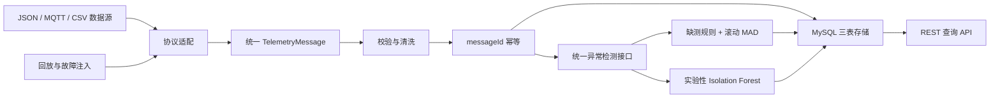

# Mangrove-MonitorLite

[English](README.md) · 简体中文

一个轻量级 Java 环境遥测参考系统，用于接入多源监测数据、执行时序数据质量检查，并通过 REST 提供带异常结果的监测数据服务。

## 项目概览

Mangrove-MonitorLite 展示如何让异构环境观测数据进入一条可追溯的处理链路，而不是为每类设备复制独立后端。来自 HTTP 的 JSON、MQTT JSON 和回放 CSV 会被转换为统一遥测模型，经过校验与清洗后写入精简 MySQL 表结构，执行数据质量异常识别，并通过 REST API 查询。

这是个人公开工程参考实现 / 面向作品集的工程重构。仓库只保留通用遥测核心、合成测试数据和本地验证资源；它不是企业官方系统，也不代表现场生产部署。

## 展示的真实能力

- 使用统一遥测模型承接普通 JSON、`fields`/`vals` 结构、MQTT 消息和 CSV 回放
- MQTT 3.1.1 QoS 1 消息接入及消息级幂等
- 必填字段、时间戳、字符串数值、空值和非有限数值校验
- 基于 `message_id` 唯一约束、原始载荷留存的 MySQL 结构化存储
- 遥测、异常、时间范围和异常类型 REST 查询
- 采样间隔缺测规则、滚动中位数/MAD 突变检测、实验性 Isolation Forest 评分
- 可重复的历史格式回放，以及缺测、单指标突变和多变量异常注入
- 可复现 JUnit 集成测试，包括真实 localhost MQTT TCP 发布—订阅

## 架构



项目保持为一个 Spring Boot 单体应用，不引入参考链路不需要的复杂服务或平台。

## 数据流

```text
数据源记录
  -> JSON/CSV 适配
  -> TelemetryMessage
  -> 必填、时间和数值清洗
  -> 重复消息检查
  -> telemetry_record
  -> 缺测 / 滚动 MAD / Isolation Forest 检测
  -> anomaly_event
  -> REST 查询
```

每条合法消息包含 `messageId`、设备标识与类型、观测/接收时间、结构版本、来源协议、标准化指标和原始载荷。未知字段保留在 `rawPayload` 中；代码不会根据字段名臆测未说明的单位或生态含义。

## 异常识别

### 缺测规则

可配置规则比较相邻观测时间与设备预期采样间隔。缺测事件记录预期间隔、实际间隔、允许倍数和推断的缺失时间范围。

### 滚动中位数与 MAD

系统按“设备 + 指标”维护独立滚动窗口。窗口预热完成后计算：

```text
robust_z = 0.6745 * |当前值 - 中位数| / MAD
```

实现显式处理窗口不足、非有限数值和 MAD 为 0 的情况。它是可解释的鲁棒统计突变检查，不是人工智能模型。

### 实验性 Isolation Forest

Java 实现使用历史窗口中的多变量数值记录训练，固定特征顺序，过滤常量列与不完整列，对新记录在线评分，并按周期重新训练。固定随机种子保证测试可重复；训练样本不足或特征不匹配时返回明确的跳过状态，不静默输出结果。

Isolation Forest 输出是工程数据质量信号，不能自动等同于生态科学异常。本仓库不声称该模型已经完成生态科学有效性验证或具备生产告警准确率。

## REST API

| 方法 | 路径 | 用途 |
|---|---|---|
| `GET` | `/api/telemetry?deviceId=...&from=...&to=...` | 查询设备在可选时间范围内的遥测记录 |
| `GET` | `/api/anomalies?deviceId=...&from=...&to=...&type=...` | 按设备、时间和异常类型查询事件 |
| `GET` | `/api/telemetry/{id}` | 查询单条遥测及其关联异常 |

时间参数使用 ISO-8601，例如 `2024-01-01T00:00:00Z`。

## 验证结果

2026-09-07 在干净公开候选目录中，使用 Java 17 和 Maven 3.8.6 重新验证：

| 检查项 | 结果 |
|---|---|
| 单元与集成测试 | **9/9 通过** |
| Maven 构建 | **PASS** |
| 本地 MQTT 3.1.1 QoS 1 发布—订阅 | **PASS** |
| 非法 MQTT 消息隔离及消费者继续工作 | **PASS** |
| H2 MySQL 模式三表、幂等与 REST 查询 | **PASS** |

复现命令：

```bash
mvn clean test
```

MQTT 测试让 Eclipse Paho 客户端通过真实 localhost TCP 连接到最小测试 broker，并完成订阅、QoS 1 发布和 PUBACK；没有使用直接调用处理方法替代网络链路。

## 快速开始

### 环境要求

- Java 17 或更高版本
- Maven 3.8 或更高版本
- 运行应用时需要 MySQL 8
- 仅在启用 MQTT 接入时需要 MQTT 3.1.1 broker

### 1. 验证项目

```bash
git clone https://github.com/FAIRY123456789/Mangrove-MonitorLite.git
cd Mangrove-MonitorLite
mvn clean test
```

测试使用 H2 内存数据库的 MySQL 兼容模式，不需要外部 broker 或真实设备。

### 2. 准备 MySQL

```sql
CREATE DATABASE mangrove_monitor_lite CHARACTER SET utf8mb4;
```

通过环境变量提供本地数据库凭据。PowerShell 示例：

```powershell
$env:MANGROVE_DB_URL = "jdbc:mysql://localhost:3306/mangrove_monitor_lite?useSSL=false&serverTimezone=UTC"
$env:MANGROVE_DB_USERNAME = "mangrove"
$env:MANGROVE_DB_PASSWORD = "replace-with-a-local-secret"
mvn spring-boot:run
```

`src/main/resources/schema.sql` 会初始化 `device_info`、`telemetry_record` 和 `anomaly_event`。

### 3. 启用 MQTT 接入（可选）

```powershell
$env:MANGROVE_MQTT_ENABLED = "true"
$env:MANGROVE_MQTT_BROKER = "tcp://127.0.0.1:1883"
$env:MANGROVE_MQTT_TOPIC = "mangrove/+/telemetry"
mvn spring-boot:run
```

示例 Topic 与合成消息：

```text
mangrove/demo-sensor/telemetry
```

```json
{
  "messageId": "demo-0001",
  "deviceId": "demo-sensor",
  "deviceType": "ENV_SENSOR",
  "observedAt": "2024-01-01T00:00:00Z",
  "schemaVersion": "1",
  "metrics": {
    "temperature": 24.8,
    "humidity": 81.2
  }
}
```

## 仓库结构

```text
src/main/java/com/example/mangroves/
  MangroveMonitorLiteApplication.java
  telemetry/
    TelemetryMessage.java
    TelemetryPipelineService.java
    MqttTelemetryGateway.java
    TelemetryRepository.java
    TelemetryController.java
    AnomalyDetector.java
    AnomalyResult.java
    AnomalyDetectionService.java
    TelemetryReplayTool.java
src/main/resources/
  application.properties
  schema.sql
src/test/java/com/example/mangroves/
  TelemetryPipelineIntegrationTest.java
  AnomalyDetectionTest.java
  ReplayFaultInjectionTest.java
src/test/resources/
  sample-telemetry.csv
```

## 范围与限制

- 这是公开工程参考实现，不是官方生产部署。
- 仓库只包含合成样本，不公开现场或业务数据。
- 本地测试不能证明长期现场可靠性、零丢包、broker 故障切换或生产吞吐。
- MySQL 路径通过 SQL/存储代码和 H2 MySQL 兼容模式集成测试验证；真实部署仍需针对自己的 MySQL 检查权限、时区和存储参数。
- 检测阈值和预期采样间隔需要按设备与场景校准。
- 实验性 Isolation Forest 使用确定性合成序列和注入异常验证，不使用带生态真值标签的数据集。
- 检测窗口保存在单个进程内；重启恢复和多实例状态一致性不在本仓库范围内。
- 身份认证、权限、告警通知、远程设备控制、可视化大屏和部署自动化均未实现。

## 许可证

本重构版本尚未选择项目许可证。公开可见不等于授予复用权；在将其作为开源软件使用前，应由维护者明确选择并加入合适许可证。